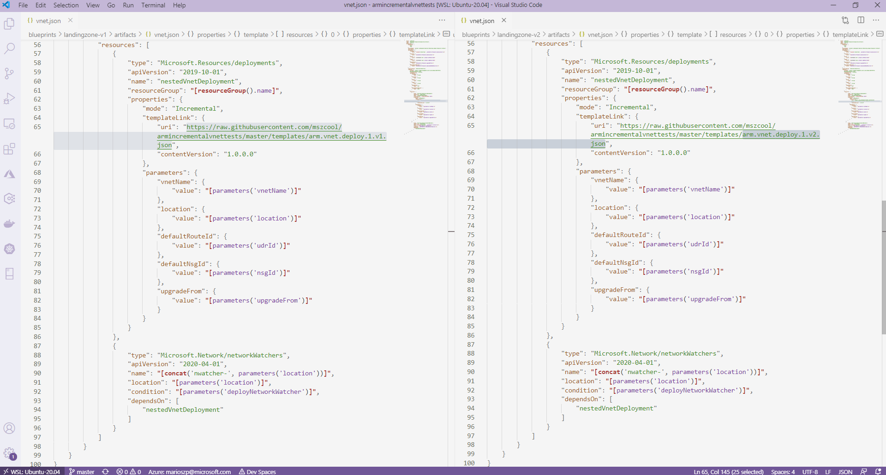
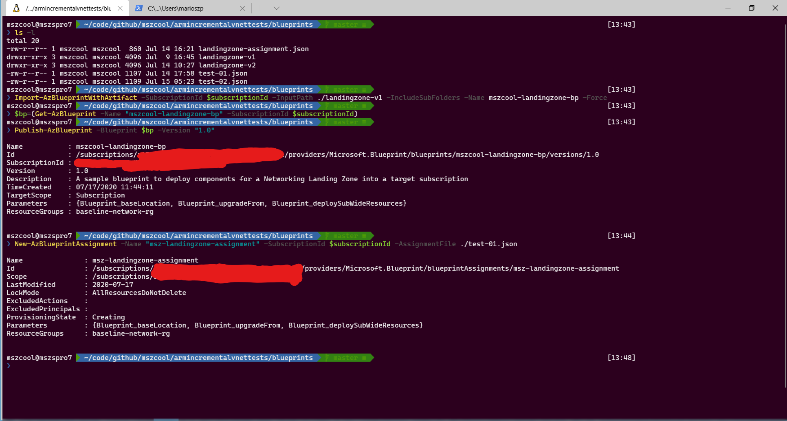
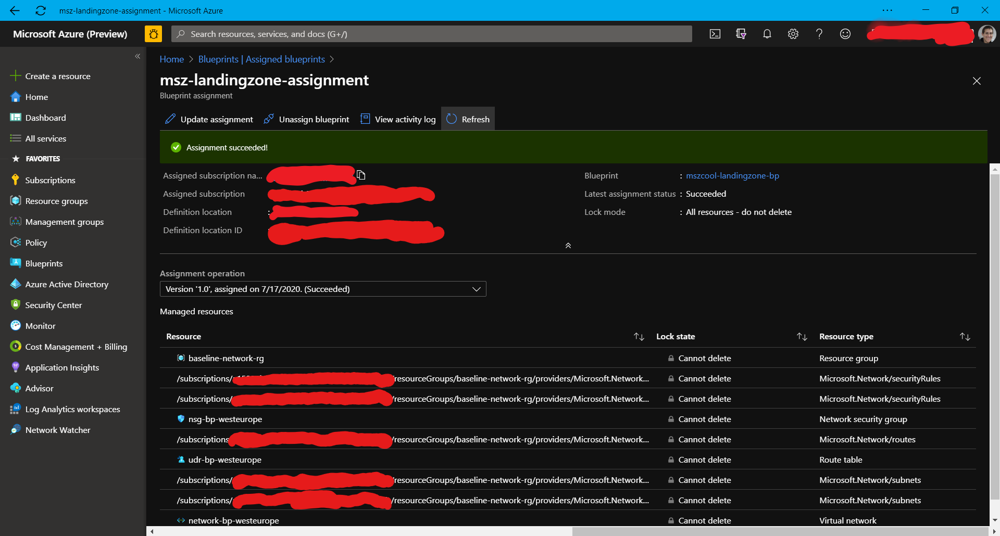
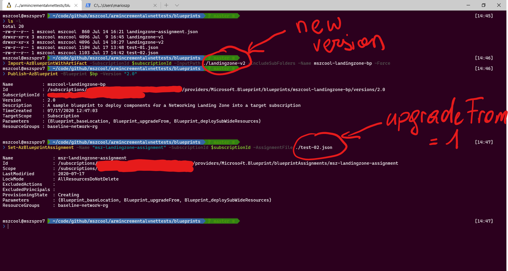
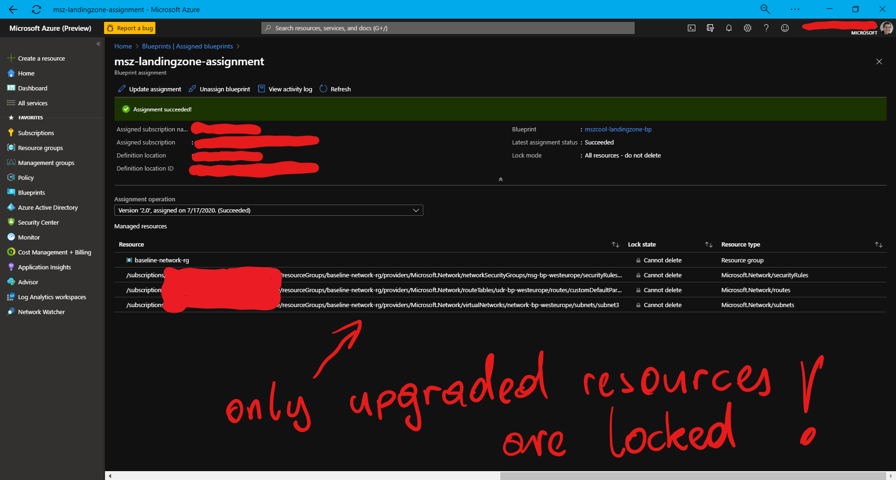
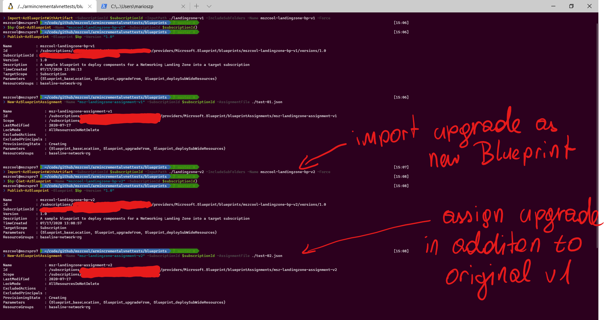
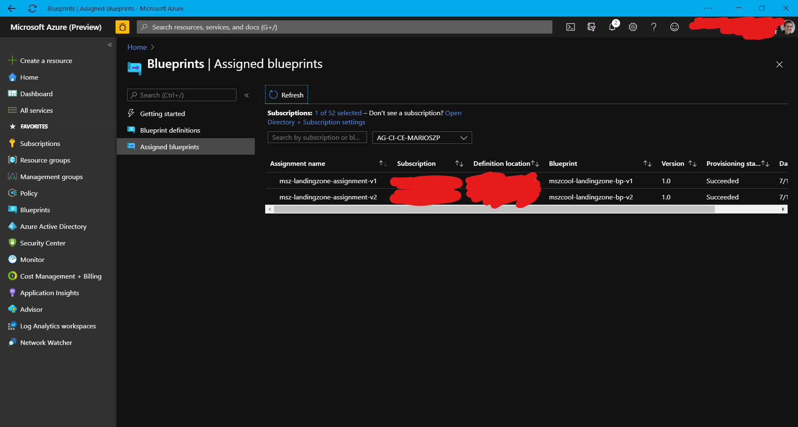

# Incremental ARM-deployments of Azure Networking Resources

**Table of Contents:**

[Summary and Context](#summary-and-context)<br/>
[Problem Analysis](#problem-analysis)<br/>
[Possible solution-concept for VNETs](#possible-solution-concept-for-vnets)<br/>
[Azure DINE Policies for Platform Deployments and Upgrades](#azure-dine-policies-for-platform-deployments-and-upgrades)<br/>
[Azure Blueprints for Platform Deployments and Upgrades](#azure-blueprints-for-platform-deployments-and-upgrades)<br/>
[Additional Resources](#additional-resources)
[Tipps and Tricks](#tipps-and-tricks)

## Summary and Context 

ARM template deployments support both, **incremental** and **complete** [deployment modes](https://docs.microsoft.com/en-us/azure/azure-resource-manager/templates/deployment-modes). When running **complete** deployments, resources are re-created from scratch at deployment-time while with **incremental** mode, resources are updated incrementally. That means most ARM template deployments are idempotent and allow changes to resources by just extending an ARM template and re-deploying it to the same target environment to which it was deployed initially for updates/extensions. This behavior is true for **most** resource providers, **but not for** many resources implemented through the **Microsoft.Network** resource provider.

If a template containing a VNET and its subnets is re-deployed to the same target environment multiple times after an initial deployment, this can lead to 
* deployment failures if resources such as virtual machines have been deployed into the VNET  through the Azure portal, scripting or other independent deployments after the initial VNET template deployment  
* or it will overwrite any changes made after the initial VNET template deployment through the Azure portal, scripting or other deployment mechanisms (i.e. other template deployments).

This repository contains assets [Azure Resource Manager Templates](https://docs.microsoft.com/en-us/azure/azure-resource-manager/templates/) to validate and confirm this behavior with networking resources and confirm idempotent behavior with other resource types.

In addition, the repository contains templates, policies and blueprints which do provide one possible work-around for implementing incremental deployments of networking resources. The motivation for this repository was driven by:

* This capability is relevant for Datacenter control plane implementations for Azure which are responsible for providing automated deployments of landing zones and respective guardrails at scale as documented in [Microsoft's Cloud Adoption Framework](https://docs.microsoft.com/en-us/azure/cloud-adoption-framework/) for [enterprise-scale Landing Zones](https://docs.microsoft.com/en-us/azure/cloud-adoption-framework/ready/enterprise-scale/architecture).
* The team responsible for the aforementioned [enterprise-scale landing zones](https://docs.microsoft.com/en-us/azure/cloud-adoption-framework/ready/enterprise-scale/architecture) is working on an alternative approach at the time of publishing this repository on my GitHub which should be considered in evaluations once completed/published.
* The goal of this research is supporting large customers moving their entire DC to Azure desire implmeneting **policy-driven Networking** (**Network Democratization**). Aligned with [subscription democratization](https://docs.microsoft.com/en-us/azure/cloud-adoption-framework/ready/enterprise-scale/design-principles), this means subscription recipients are empowered to manage networking related resources on their own while centrally implemented guard rails enforce compliance/security.

Such an approach will give application teams the flexibility and agility they need to decrease time-to-market and enable fast-paced innovation. With Networking resources in Azure, it introduces a special challenge, though. Assets in this repository can be used to confirm that challenge (as of July 2020) and show one possible work-around implementation.

## Problem Analysis

A **Datacenter control plane**, referred to as **platform** for the remainder, is responsible for deploying [landing zones](https://docs.microsoft.com/en-us/azure/cloud-adoption-framework/ready/landing-zone/) (aka target subscriptions with baseline resources). As the platform evolves, required components for landing zones might change and evolve over time as well. Examples of such changes might include but are not limited to:

* Additional VNET subnets
* New network security or application security rules
* Changes or updates to user defined routes
* New types of resources not previously in older landing zone deployments

When implementing a DC control plane, the platform team needs to define and implement strategies for upgrading existing (previously deployed) landing zones to match the new requirements and implement updates as described in the bullet list above.

Because most ARM template deployments are idempotent, many (not all) changes can be implemented by extending / adjusting existing ARM templates and re-deploying them as part of platform pipelines or policies. This is true for many resource providers, but it is **confirmed to be not true for the Microsoft.Network resource provider**.

Redeploying ARM templates for networking resources such as Virtual Networks, Network Security Groups or User Defined Routes do always **recreate the resources from scratch without implementing incremental deployments**. This behavior can be confirmed by deploying an ARM template for a VNET such as [this example](https://github.com/mszcool/armincrementalvnettests/blob/master/templates/arm.vnet.deploy.1.v1.json), then making changes to the target VNET and attempting to re-deploy the very same (or an updated version) of this template to the same subscription. Furthermore, if a network has Virtual Machines (or other Connected Devices) deployed, already, each re-deployment of a template that creates a Virtual Network will fail even if it does not apply changes to subnets with resources deployed.

Tests have confirmed that this is true for at least the following resource types of the `Microsoft.Network` resource provider, but it might not be limited to those:

* Virtual Networks
* User Defined Routes
* Network Security Groups

This behavior has been confirmed in several forum threads across the community:

* [feedback.azure.com](https://feedback.azure.com/forums/217313-networking/suggestions/18758545-support-vnet-re-deployment-without-destroying-subn)
* [Azure quick start templates](https://github.com/Azure/azure-quickstart-templates/issues/2786#issuecomment-382489945)

Regardless of whether [Azure Policy]https://docs.microsoft.com/en-us/azure/governance/policy/overview) or [Azure Blueprints](https://docs.microsoft.com/en-us/azure/governance/blueprints/overview) are used, the following challenge needs to be addressed: how should platform-upgrades to landing zones be performed in a large DC control plane environment and what are the advantages and disadvantages of using either Policy or Blueprints or a combination of both!***

## Possible solution-concept for VNETs

There are workarounds available which enable incremental re-deployment of networking related resources. While the approach has some limitations, it does work for a set of common scenarios such as re-deploying a VNET-template for adding a new subnet.

The concept is simple: add a condition to VNET-based resources to deploy them as part of an ARM template deployment if a re-deployment / re-creation is needed, only. A simple example is the following exceprt of the `resources` section of an ARM template:

```json
"resources": [
    {
        "type": "Microsoft.Network/virtualNetworks",
        "apiVersion": "2020-04-01",
        "name": "[parameters('vnetName')]",
        "location": "[parameters('location')]",
        "condition": "[parameters('isNewDeployment')]",
        "properties": {
            "addressSpace": {
                "addressPrefixes": [
                    "[parameters('vnetAddressSpace')]"
                ]
            }
        }
    }
]
```

The example assumes a parameter of type `bool` with the name `isNewDeployment` being passed in. The VNET will be deployed (or re-created if the template is re-deployed) if that parameter is `true`, only. On the very first deployment of this template, a user would need to pass the value `true` in for such a template to get the VNET deployed. Any further extension, i.e. such as the addition of a subnet, would require to pass in `false` for this parameter to ensure the VNET is not destroyed and re-created at the template deployment.

This approach requires to have child-resources not specified through properties or as child-resources of the VNET resource. Instead, they need to be specified as top-level resources as shown in the following example:

```json
"resources": [
    {
        "type": "Microsoft.Network/virtualNetworks", 
        "name": "[parameters('vnetName')]",
        "condition": "[parameters('isNewDeployment')]",
        ...
    }
    {
        "type": "Microsoft.Network/virtualNetworks/subnets",
        "apiVersion": "2020-04-01",
        "name": "[concat(parameters('vnetName'),'/subnet1')]",
        "dependsOn": [
            "[parameters('vnetName')]"
        ],
        "properties": {
            "addressPrefix": "[parameters('defaultSubnetSpace1')]",
            "routeTable": {
                "id": "[parameters('defaultRouteId')]"
            },
            "networkSecurityGroup": {
                "id": "[parameters('defaultNsgId')]"
            }
        }
    }
]
```

The condition can be applied to subnets as well to prevent re-creation of subnets which have been created, already.

### Enabling "differential" deployments

The approach can be expanded from using the `[condition()]` function to check a numeric value that could potentially express the version number of a template that is deployed in the target landing zone / subscription, already. That way, only those resources which are expected to be added by a newer version of the template can be deployed when applying a newer version of the ARM template to a target environment.

Consider the following section of an ARM template which deploys a network, and assumes this snippet belongs to the [arm.vnet.deploy.1.v1.json](https://github.com/mszcool/armincrementalvnettests/blob/master/templates/arm.vnet.deploy.1.v1.json) ARM template:

```json
{
    "type": "Microsoft.Network/virtualNetworks",
    "apiVersion": "2020-04-01",
    "name": "[parameters('vnetName')]",
    "location": "[parameters('location')]",
    "condition": "[lessOrEquals(parameters('upgradeFrom'), -1)]",
    "properties": { ... }
},
{
    "type": "Microsoft.Network/virtualNetworks/subnets",
    "apiVersion": "2020-04-01",
    "name": "[concat(parameters('vnetName'),'/subnet1')]",
    "condition": "[lessOrEquals(parameters('upgradeFrom'), 0)]",
    "dependsOn": [ ... ],
    "properties": { ... }
}
```

The instances of the `[condition()]` function in the template above do deploy the respective VNET and subnets if the `[parameters('upgradeFrom')]` value is larger than `-1` and `0` respectively. If that template is deployed for the very first time into a target landing zone, then it should be deployed with the parameter `upgradeFrom=-1` so that all resources are deployed. If a subsequent change needs to happen for the `subnet1` resource only, then the template could be deployed with the parameter `upgradeFrom=0`. That way, the template deployment would impact `subnet1`, only.

This concept can be expanded when i.e. a newer version of the template is created for a newer version of a target landing zone as shown in the following snippet from the [arm.vnet.deploy.1.v2.json](https://github.com/mszcool/armincrementalvnettests/blob/master/templates/arm.vnet.deploy.1.v2.json) ARM template:

```json
        {
            "type": "Microsoft.Network/virtualNetworks",
            "apiVersion": "2020-04-01",
            "name": "[parameters('vnetName')]",
            "location": "[parameters('location')]",
            "condition": "[lessOrEquals(parameters('upgradeFrom'), -1)]",
            "properties": { ... }
        },
        {
            "type": "Microsoft.Network/virtualNetworks/subnets",
            "apiVersion": "2020-04-01",
            "name": "[concat(parameters('vnetName'),'/subnet1')]",
            "condition": "[lessOrEquals(parameters('upgradeFrom'), 0)]",
            "dependsOn": [ ...],
            "properties": { ... }
        },
        {
            "type": "Microsoft.Network/virtualNetworks/subnets",
            "apiVersion": "2020-04-01",
            "name": "[concat(parameters('vnetName'),'/subnet2')]",
            "condition": "[lessOrEquals(parameters('upgradeFrom'), 0)]",
            "dependsOn": [ ... ],
            "properties": { ... }
        },
        {
            "type": "Microsoft.Network/virtualNetworks/subnets",
            "apiVersion": "2020-04-01",
            "name": "[concat(parameters('vnetName'),'/subnet3')]",
            "condition": "[lessOrEquals(parameters('upgradeFrom'), 1)]",
            "dependsOn": [ ... ],
            "properties": { ...}
        }
```

While the conditions for the resources that were present in the first version [arm.vnet.deploy.1.v1.json](https://github.com/mszcool/armincrementalvnettests/blob/master/templates/arm.vnet.deploy.1.v1.json) are still exactly looking the same, resources which have been added to the second version [arm.vnet.deploy.1.v2.json](https://github.com/mszcool/armincrementalvnettests/blob/master/templates/arm.vnet.deploy.1.v2.json) contain a `[condition()]` which would allow them to be the only resources deplyoed when upgrading an existing landing zone.

In case of a blank deployment, the v2-template would be deployed with the parameter `upgradeFrom=-1` just like it's v1-template would be before. But if the template is applied to a landing zone which has the v1-version of the template applied from previous deployments, already, it can be deployed with the parameter `upgradeFrom=1` as we are upgrading the landing zone **from version v1** to **version v2**. That way, based on the example above, only `subnet3` would get deployed when deploying with `upgradeFrom=1`. With this implementation, VNETs can be upgraded from one particular deployment version to another through template deployments.

### Considerations on this approach

This approach has a few limitations and requires certain ARM-template coding rules and conventions to be followed for it to work:

* Child resources that need to be updated should be deployed as independent, top-level resources in the template instead of child resources of the respective parent resource.
* Not all the updates can be implemented this way, unfortunately. I.e. NSGs or Routes are attached to subnets through subnet-properties. That means, the NSGs and Routes need to be there for the first deployment or, if applied afterwards, need to be applied through imperative updates (i.e. PowerShell, Azure CLI).
* In light of the networking resources mentioned earlier in this article, the following practical guidelines need to be true for this to work:
  * NSGs need to be associated to subnets starting with the initial version of a VNET template.
  * UDRs need to be associated to subnets starting with the initial version of a VNET template.
  * Routes of User Defined Routes need to be formulated as "root-resources" in templates instead of being outlined as properties of the UDR resource.
  * Rules of NSGs need to be formulated as "root-resouces" in templates instead of being outlined as properites of the NSG resource.
  * Each template for networking resources should be maintained as its own version and should allow for incremental deployments through `[conditions()]` deploying resources if they've not been deployed with previous versions of a template, already.

In theory, this approach can be implemented through both, Azure Policies (DINE policies) or Azure Blueprints. The implementation might not be practical for all cases, though, and the considerations outlined above for ARM template coding are introducing limitations that need to be weighted against other requirements, policies and convenience.

## Azure DINE Policies for Platform Deployments and Upgrades

Azure `DeployIfNotExists` (DINE) policies can be used for rolling out platform components. Using Azure DINE policies for platform components rollouts/enforcements in landing zones is the implementation approach recommended and implemented by the [Cloud Adoption Framework / Enterprise Scale](https://docs.microsoft.com/en-us/azure/cloud-adoption-framework/ready/enterprise-scale/). For more information, see the following [Azure Policy](https://github.com/Azure/Enterprise-Scale/blob/main/azopsreference/3fc1081d-6105-4e19-b60c-1ec1252cf560/contoso/.AzState/Microsoft.Authorization_policyDefinitions-Deploy-vNet.parameters.json) definition.

Implementing the incremental deployment strategy/approach for networking with Azure DINE policies as outlined in the previous section is not practical, though. This approach using `[condition()]` elements in the ARM template is realized through a parameter. In case of policies, parameters are passed in at assignment time and platform-policies are recommended to be assigned at the management group level as much as possible. Hence it is much harder to express the reality of having different versions of landing zones being deployed across the cloud native DC (even if that's just a temporal situation). A practical alternative might be working with subscription-level tags outlining the currently deployed version of a landing zone.

A full example of a policy implementing the approach is available [here](https://github.com/mszcool/armincrementalvnettests/blob/master/policies/arm.policy.vnet.definition.json). This policy uses a tag to determine, if a VNET for the target landing zone should be deployed. If so, the deployment task link to an ARM-template which implements the aforementioned approach using `[condition()]` for full or incremental VNET deployments.

```json
{
    "if": {
        "allOf": [
            {
                "field": "type",
                "equals": "Microsoft.Resources/subscriptions"
            },
            {
                "field": "tags['vnetRequired']",
                "equals": "true"
            }
        ]
    },
    "then": {
        "effect": "deployIfNotExists",
        "details": {
            "type": "Microsoft.Network/virtualNetworks",
            ...
            "existenceScope": "subscription",
            "existenceCondition": {
                "allOf": [
                    ...
                ]
            },
            "deploymentScope": "subscription",
            "deployment": {
                "location": "[parameters('policyDeployLocation')]",
                "properties": {
                    "mode": "incremental",
                    "parameters": { ... },
                    "template": {
                        "$schema": "...",
                        "contentVersion": "1.0.0.0",
                        "parameters": { ... },
                        "resources": [
                            {
                                "type": "Microsoft.Resources/resourceGroups",
                                ...
                            },
                            {
                                "type": "Microsoft.Resources/deployments",
                                "apiVersion": "2019-10-01",
                                "name": "nestedVnetDeployment",
                                "resourceGroup": "[[parameters('networkRgName')]",
                                "dependsOn": [ ... ],
                                "properties": {
                                    "mode": "Incremental",
                                    "templateLink": {
                                        "uri": "https://.../arm.vnet.deploy.1.json",
                                        "contentVersion": "1.0.0.0"
                                    },
                                    "parameters": {
                                        "vnetName": { "value": "..." },
                                        "location": { "value": "..." },
                                        "isNewDeployment": { "value": true | false }
                                    }
                                }
                            }
                        ]
                    }
                }
            }
        }
    }
}
```

As you can see, the `isNewDeployment` parameter is passed into the ARM template linked in the policy. This condition can easily be controlled through a parameter during policy assignment, although this might not fulfill most of the upgrade scenarios for landing zones, unfortunately. If hardcoded as shown in the sample above, the policy would re-deploy from scratch for every remediation. Hence, if i.e. Virtual Machines are deployed into the VNET, the auto-remediation would fail and landing zone owners would need to manually fix the state of the landing zone. **Important:** manual fixing of landing zones might be required anyways for complex deployment scenarios.

## Azure Blueprints for Platform Deployments and Upgrades

Deploying landing zones with Azure Blueprints is a very convenient approach. In such scenarios, Blueprints are packaging all resources required for a landing zone into a single assignment. Just like policies, Blueprints are impacted the same way by `Microsoft.Network` resource provider operations not being truly incremental with template-based deployments. Hence, neither Policies nor Blueprints solve the challenge of incrementally upgrading Networking resources without deleting existing resources deployed in a landing zone, already.

The incremental deployment approach outlined earlier in this document can easily be implemented with Blueprints for the following reasons:

* Blueprints do accept parameters at definition **and** assignment.
* Blueprints are assigned to subscriptions (aka landing zones), directly. During assignment, landing zone specific considerations can be incorporated.

As part of a Blueprint deployment, the incremental ARM template deployment approach for VNETs can be implemented through a Blueprint parameter as shown below:

```json
{
    "type": "Microsoft.Blueprint/blueprints",
    "name": "landingzone-baseline-blueprint",
    "properties": {
        "targetScope": "subscription",
        "parameters": {
            "Blueprint_baseLocation": { ... },
            "Blueprint_upgradeFrom": {
                "type": "int",
                "metadata": {
                    "displayName": "Upgrade from previous version of a blueprint?"
                }
            },
            "Blueprint_deploySubWideResources": { ... }
        },
        "resourceGroups": { ... }
    }
}
```

This upgrade-parameter would be passed through the artifacts of the blueprint down to the ARM template which implements the actual network resources deployments. Excerpts are shown below:

```json
{
    "kind": "template",
    "type": "Microsoft.Blueprint/blueprints/artifacts",
    "name": "vnet-lz",
    "properties": {
        "dependsOn": [ ... ],
        "displayName": "...",
        "parameters": {
            "vnetName": { "value": " ... " },
            "location": { "value": "[parameters('Blueprint_baseLocation')]" },
            "udrId": { ... },
            "nsgId": { ... },
            "upgradeFrom": {
                "value": "[parameters('Blueprint_upgradeFrom')]"
            }
        },
        "resourceGroup": "baseline-network-rg",
        "template": {
            "$schema": "...",
            "contentVersion": "1.0.0.0",
            "parameters": {
                ...,
                "upgradeFrom": {
                    "type": "int"
                }
            },
            "resources": [
                {
                    "type": "Microsoft.Resources/deployments",
                    "apiVersion": "2019-10-01",
                    "name": "nestedVnetDeployment",
                    "resourceGroup": "[resourceGroup().name]",
                    "properties": {
                        "mode": "Incremental",
                        "templateLink": {
                            "uri": "https://.../arm.vnet.deploy.1.v1.json",
                            "contentVersion": "1.0.0.0"
                        },
                        "parameters": {
                            ...,
                            "upgradeFrom": {
                                "value": "[parameters('upgradeFrom')]"
                            }
                        }
                    }
                }
            ]
        }
    }
}
```

During the assignment of a blueprint to a subscription, the `upgradeFrom`-parameter can be defined as shown in the following example:

```json
{
    "type": "Microsoft.Blueprint/blueprintAssignments",
    "name": "assignment-sampleplatform-vnet",
    "location": "westeurope",
    "identity": { ... },
    "properties": {
        "blueprintId": "...",
        "locks": {
            "mode": "allResourcesDoNotDelete"
        },
        "resourceGroups": { ... },
        "parameters": {
            "Blueprint_baseLocation": { "value": "westeurope" },
            "Blueprint_upgradeFrom": { "value": -1 }
        }
    }
}
```

During the initial roll-out of a landing zone, meaning the creation of the subscription and its baseline resources, the Blueprint would always be assigned with the parameter `Blueprint_upgradeFrom=-1` so that all resources are deployed - regardless of which version of the blueprint with which version of the respective ARM template gets deployed. That way, when following the implementation approach outlined in this document, all networking resources will be created.

### Creating a new version of the Blueprint

Building new versions of a Blueprint is mostly as straightforward as it used to be without the approach explained above:

* Create a new folder with the blueprint definition and artifacts and build it following the same approach as outlined above.
* The artifacts for networking can then refer to a newer version of networking-related ARM templates similar to the original version. If the conditional logic is fully implemented in the ARM templates, then the new version of the Blueprint will literally look the same way as the old one (in the context of networking as discussed in this document).

An example for comparison is available in [this public GitHub repository](https://github.com/mszcool/armincrementalvnettests) with a [v1 of a Blueprint](https://github.com/mszcool/armincrementalvnettests/tree/master/blueprints/landingzone-v1) and a [v2 of a Blueprint](https://github.com/mszcool/armincrementalvnettests/tree/master/blueprints/landingzone-v2) deploying networking resources of a landing zone.



When deploying the v2-blueprint to a new landing zone, it would get assigned to the (new) target subscription with the Blueprint parameter `Blueprint_upgradeFrom=-1` to ensure all resources are deployed as the condition is always met. When upgrading an existing landing zone that has the v1 of the Blueprint assigned, already, it would get deployed with `Blueprint_upgradeFrom=1` as we are upgrading from the deployed version `1` to the new version `2` in such a landing zone. The assignment would look as follows then:

```json
{
    "type": "Microsoft.Blueprint/blueprintAssignments",
    "name": "assignment-sampleplatform-vnet",
    "location": "westeurope",
    "identity": { ... },
    "properties": {
        "blueprintId": "...",
        "locks": {
            "mode": "allResourcesDoNotDelete"
        },
        "resourceGroups": { ... },
        "parameters": {
            "Blueprint_baseLocation": { "value": "westeurope" },
            "Blueprint_upgradeFrom": { "value": 1 }
        }
    }
}
```

This approach can be continued consistently for each new version of the deployment of a Blueprint containing networking related resources.

**Important:** this approach has the same limitations as the pure ARM-templated based approach without policies or blueprints suffers from! Updating properties for existing resources won't work for `Microsoft.Network`-related resources, unfortunately. That means, i.e. an initial deployment always should associate subnets with their NSGs and UDRs as these assignments do happen through properties on the subnet resource. Given the deployment of subnets in `Microsoft.Network` is not incremental, either, it would attempt to redeploy such subnets in case these properties need to be updated. This is a significant limitation of the approach, but it is as good as it can get (apart from manual updates) at the time of writing this document.

### Assigning Blueprints with incremental upgrades

Usually, upgrading an existing Blueprint assignment is as easy as publishing a new version of the Blueprint and subsequently updating the Blueprint assignment on a subscription. This works for all Blueprints that require to apply incremental upgrades to Networking-resources and hence have to adopt the approach outlined earlier in this document.

**Reason:** Blueprints are often applied with locks on resources. These locks are applied to all resources which are deployed with the Blueprint assignment. Using `[condition()]` for resource deployments might lead to some resources not being deployed / applied with the ARM template deployments part of the Blueprint assignment. Such resources would not get the lock applied, even if they were deployed with previous versions of the Blueprint. Locks are only applied for resources which are deployed with the current assignment of the Blueprint.

Consider a [version 1 of a Blueprint such as this one](https://github.com/mszcool/armincrementalvnettests/tree/master/blueprints/landingzone-v1) which you import, publish and assign to a subscription with PowerShell as follows:



After this assignment being completed, the Blueprint deployed all resources and applied the lock respectively as shown in the next screenshot:



When publishing a second version of the Blueprint, the typical approach would be to repeat the very same process as above, but when publishing the new version of the Blueprint, you should specify a version increment. When upgrading Networking resources, the straightforward thinking might be to just publish the second version of the Blueprint but perform the assignment with the respective `Blueprint_upgradeFrom=1` parameter in the assignment to avoid re-deploying the VNET from scratch. 



This will lead to an unwanted result: the resources deployed with the initial version of the Blueprint but not re-deployed with the second version are not locked anymore as confirmed by the following screenshot:



This requires a different approach when upgrading Blueprints from one version to another which are required to support incremental upgrades of `Microsoft.Network` resources: **each new version of the Blueprint needs to become it's separate definition and assignment** as shown in the following screen shots - this will produce the expected results.





In the above example, each of the Blueprint assignments will lock the resources it deploys with its assignment. That way, all the originally deployed resources from the first version and the added resources from the second version are protected. If a blank, new landing zone gets deployed, it needs to have just the assignment to the latest definition of the Blueprint version with `Blueprint_upgradeFrom=-1` if the above described approach is followed consistently to have all resources deployed with the assignment to the new landing zone. The big disadvantage of this approach clearly is, that the number of assignment is growing depending on the amount of upgrades being rolled out.

## Additional Resources

* No user-assigned managed identity supported: https://feedback.azure.com/forums/915958-azure-governance/suggestions/39977704-deployifnotexists-policy-add-user-assigned-manag
* No policy on delete: https://stackoverflow.com/questions/56928456/can-we-create-a-custom-policy-in-azure-to-prevent-the-deletion-of-the-resources/56928723#56928723
* More no policy on delete: https://feedback.azure.com/forums/915958-azure-governance/suggestions/38405599-azure-policy-effect-deny-doesn-t-work-on-api-cal
* Dev experience for requires improvements: https://feedback.azure.com/forums/216665-scripting-and-command-line-tools/suggestions/35326141-reevaluate-azure-policy-button-powershell-command
* Discussion on VNET incremental deployments on feedback.azure.com: https://feedback.azure.com/forums/217313-networking/suggestions/18758545-support-vnet-re-deployment-without-destroying-subn
* Discussion on VNET incremental deployments for one of the Azure quick start templates: https://github.com/Azure/azure-quickstart-templates/issues/2786#issuecomment-382489945

## Tipps and Tricks

At the time of writing this document, a few implementation and scripting tipps were collected. I.e. using `armclient` for automated assignment for Blueprints in Linux-based environments or considerations for definitions of Azure Policies through ARM templates. These can be found in the Markdown file [Tipps and Tricks](tipps-and-tricks.MD).